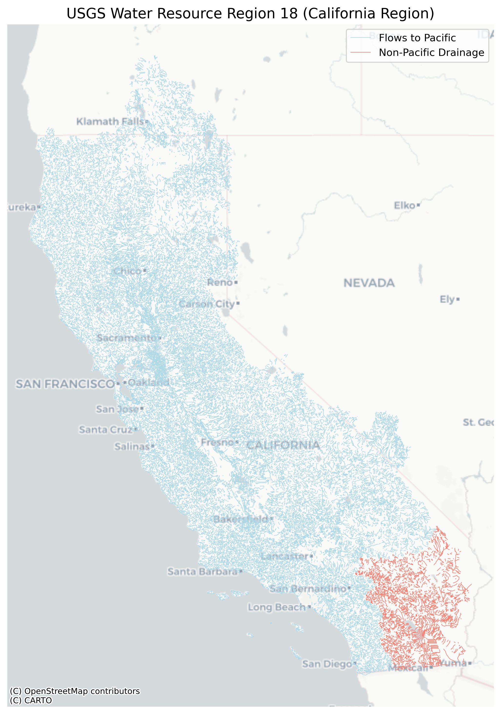

# USGS WR18 Streamflow Daily Averages Data Package

This dataset contains daily streamflow data and associated hydrologic features for USGS Water Resource Region 18 (WR18). It was created by processing hourly streamflow data from the National Water Model v3.0 (1979–2023 retrospective) into daily means, specifically for StreamRiver features in HUC-2 region 18.

- **Region Name**: Water Resource Region 18  
- **HUC-2**: 18  
- **States Covered**: California, Nevada  
- **Included HUC-4s**:  
  `1801`, `1802`, `1803`, `1804`, `1805`, `1806`, `1807`, `1808`, `1809`, `1810`  
- **Excluded HUC-4s**:  
  `1606`, `1712`  
  - *Note: Vector Processing Unit 18 included 1606 and 1712, but these are not part of HUC-2 region 18 and were excluded.*
 


## Package documentation

This repo contains the files and instructions for creating the Google Cloud Data here [CB/wr18](https://console.cloud.google.com/storage/browser/nmfs_odp_nwfsc/CB/nwm_daily_means/wr18?pageState=(%22StorageObjectListTable%22:(%22f%22:%22%255B%255D%22))&invt=AbtSUA&project=noaa-gcs-public-data) for mean daily streamflow 1979-2023 for all of California. See the `notebooks` directory for how the files were created.

### Google Cloud Bucket structure

The `flowline` and `streamflow` files are not in this GitHub repo (they are big). You will find them in the Google Cloud Bucket.

```
bucket/
└── wr18/                           
    ├── flowline/                   # All vector data for the region
    │   ├── WR_18_Flowline.parquet
    │   ├── WR_18_metadata.parquet
    │   └── README.md               
    │
    ├── streamflow/                 # NetCDF and Zarr files
    │   ├── netcdf/
    │   └── zarr/
    │
    ├── notebooks/                  # Reproducibility and how-to examples
    │   ├── package_structure.ipynb
    │   ├── shapefile_processing.ipynb
    │   ├── streamflow_processing.ipynb
    │   ├── save_to_gcp.ipynb
    │   └── README.md               
    │
    └── metadata/                   # Additional documentation
        ├── wr18_hydro_metadata.json
        └── README.md
```

- **Storage Format**: NetCDF and Zarr  
- **Cloud Storage**: AWS S3  
- **Region**: `us-east-1`  
- **Access**: Public, anonymous


### Streamflow Data Access

Python (Zarr)
```
import xarray as xr
zarr_url = "gcs://nmfs_odp_nwfsc/CB/nwm_daily_means/zarr"
ds = xr.open_zarr(zarr_url, consolidated=True)
subset = ds["streamflow"].sel(time="2018").isel(feature_id=1).plot()
```

Python (download netcdf)
Use the Zarr file for cloud workflows. But if you want to download one year's netcdf use this.
```
import xarray as xr
import urllib.request
url = "https://storage.googleapis.com/nmfs_odp_nwfsc/CB/nwm_daily_means/netcdf/daily_mean_2018.nc"
local_path = "daily_mean_2018.nc"
urllib.request.urlretrieve(url, local_path)
ds = xr.open_dataset(local_path)
```

R (does not allow accessing data in the cloud!)
You have to download the files. Ack.
```
library(ncdf4)
url <- "https://storage.googleapis.com/nmfs_odp_nwfsc/CB/nwm_daily_means/netcdf/daily_mean_2018.nc"
download.file(url, "daily_mean_2018.nc", mode = "wb")
nc <- nc_open("daily_mean_2018.nc")
```

### Source of hourly streamflow data

- **Source Dataset**: NOAA National Water Model v3.0 Retrospective (1979–2023)  
- **Original Data Access**: [AWS Open Data Registry](https://registry.opendata.aws/nwm-archive/)  
- **Zarr Path**: `s3://noaa-nwm-retrospective-3-0-pds/CONUS/zarr/chrtout.zarr`  
- **Filter**: Only features with `FTYPE == 'StreamRiver'`  
- **Subset Method**: Match COMIDs from WR18 flowline metadata with `feature_id` in NWM output  
- **Processing step to compute daily means from hourly data:**  
`daily_mean = streamflow_ts.resample(time="1D").mean().compute()`
- **Output Formats**: NetCDF and Zarr


## Flowline Source: NHDPlusV2.1

This is the map of where the streams and rivers are.

- **Source**: EPA NHDPlusV2.1, Vector Processing Unit 18  
- **Download URL**: [EPA NHDPlus VPU 18](https://www.epa.gov/waterdata/nhdplus-california-data-vector-processing-unit-18)  Original file: `NHDPlusV21_CA_18_NHDSnapshot_05.7z`  
- **Processed Output**: `metadata/WR_18_Flowline.parquet`


### Flowline Attributes Summary

| Attribute       | Description                                                    |
|-----------------|----------------------------------------------------------------|
| Total Features  | 178,868                                                        |
| FTYPE Values    | StreamRiver, ArtificialPath, CanalDitch, Connector, Pipeline   |
| FCODE Info      | See `WR_18_metadata.parquet` for full list                     |
| Geometry Types  | LineString or MultiLineString                                  |
| CRS (Original)  | `ESRI:102039` (USA_Contiguous_Albers_Equal_Area_Conic_USGS)    |
| CRS (Parquet)   | `EPSG:3857` (Web Mercator)                                     |

**Geometry cleaning steps:**

- Dropped empty or invalid geometries  
- Converted to 2D LineString (stripped Z/M if present)

### Accessing the flowline data

Python (need to download)
```
import urllib.request
import geopandas as gpd
url = "https://storage.googleapis.com/nmfs_odp_nwfsc/CB/nwm_daily_means/wr18/flowline/WR_18_Flowline.parquet"
local_path = "WR_18_Flowline.parquet"
urllib.request.urlretrieve(url, local_path)
gdf = gpd.read_parquet("WR_18_Flowline.parquet")
gdf = gdf[gdf["HUC4"] == "1810"]  # optional filter
gdf.plot()
```

R (can read from url but need to monkey with geometry)
```
library(arrow)
library(sf)
library(ggplot2)

url <- "https://storage.googleapis.com/nmfs_odp_nwfsc/CB/nwm_daily_means/wr18/flowline/WR_18_Flowline.parquet"
df <- as.data.frame(read_parquet(url))
df_small <- subset(df, HUC4 == "1810")

# Build sf object
geom <- st_as_sfc(df_small$geometry, EWKB = TRUE)
df_small$geometry <- NULL
gdf <- st_sf(df_small, geometry = geom)

# Plot just the geometry
ggplot(st_geometry(gdf)) +
  geom_sf(color = "steelblue", size = 0.3) +
  theme_minimal()
```

---

## Processing Date

**March 28, 2025**

---

## Author

**Eli Holmes**  
NOAA Fisheries  
eli.holmes@noaa.gov

----

## Example of a plot in R

```
library(ncdf4)
library(ggplot2)

# Get file via download
url <- "https://storage.googleapis.com/nmfs_odp_nwfsc/CB/nwm_daily_means/wr18/streamflow/netcdf/daily_mean_2018.nc"
download.file(url, "daily_mean_2018.nc", mode = "wb")

# Open the file
nc <- ncdf4::nc_open("daily_mean_2018.nc")

# Read the time variable
time_raw <- ncvar_get(nc, "time")
time_units <- ncatt_get(nc, "time", "units")$value
time_origin <- sub("days since ", "", time_units)
time <- as.Date(time_raw, origin = time_origin)

# Read streamflow for one feature_id (e.g., index 1)
feature_id <- ncvar_get(nc, "feature_id")
fid <- 344103
fid_col <- which(feature_id == fid)
streamflow <- ncvar_get(nc, "streamflow")[fid_col,]  # all time steps, first feature_id

# Close NetCDF file
nc_close(nc)

# Create data frame
df <- data.frame(time = time, streamflow = streamflow)

# Plot
ggplot(df, aes(x = time, y = streamflow)) +
  geom_line(color = "steelblue") +
  labs(title = "Daily Mean Streamflow (Feature ID 1)",
       x = "Date", y = "Streamflow (m³/s)") +
  theme_minimal()
```

---

## Processing Date

**March 28, 2025**

---

## Author

**Eli Holmes**  
NOAA Fisheries  
eli.holmes@noaa.gov
